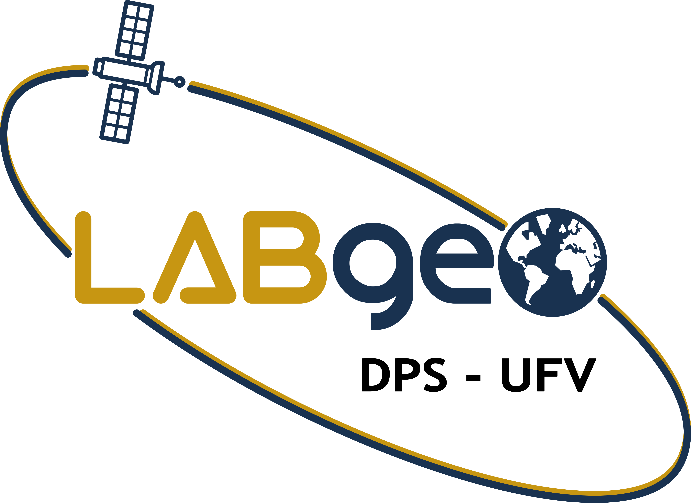

&nbsp;

## High-resolution mapping of soil carbon stocks in the western Amazon
Welcome to the repository dedicated to the R programming language source code for the scientific article **High-resolution mapping of soil carbon stocks in the western Amazon**. This repository aims to transparently and accessibly provide the scripts and algorithms used in the analysis and mapping of soil carbon in the state of Rondônia, Brazil. This repository establishes a solid foundation for the replication of results and the enhancement of research.

### Objective:
The main goal of this repository is to facilitate the understanding and replication of the conducted study, allowing researchers, students, and interested individuals to access the code and algorithms used to process and analyze geospatial data related to soil carbon in Rondônia. Additionally, it promotes open, transparent, and accessible science in open source (`R language`).

### Repository content:
#### R Scripts:
[Construction of splines.](./pages/splines.md) 
[Model fitting.](./pages/fit_model.md) 
[Map prediction.](./pages/pred_map.md) 
[Stratification of SOC stocks in protected areas and soil classes.](./pages/strat.md) 
[Comparison of our model with national and global models.](./pages/comp_models.md) 

#### Datasets:
[Data samples used in the study.](./pages/comp_models.md) 
[Environmental predictors.](./pages/predictors.md) 
[Final dataset for model fitting and result reproduction.](./pages/dataset_ocs.md) 

### Attention:
The authors are not obligated to provide user support, updates, or any bug fixes.

### How to contribute:
For more information or collaboration opportunities, please use the emails cassiomoquedace@gmail.com or labgeo@ufv.br.

### Acknowledgments:
We appreciate your interest in this work. We hope that this repository not only provides a solid foundation for result replication but also serves as support for future research related to soil carbon mapping and the use of machine learning in digital soil mapping in similar contexts.

### Reference:
Moquedace, C. M., Baldi, C. G. O., Siqueira, R. G., Cardoso I. M., Souza, E. F. M., Fontes, R. L. F., Francelino, M. R., Gomes, L. C., Fernandes-Filho, E. I. High-resolution mapping of soil carbon stocks in the western Amazon. *Geoderma Regional*, v. xxx, p. xxx, 2024.

We hope this repository serves as a resource for the scientific community interested in soil carbon mapping studies and the application of machine learning techniques. Collaboration is essential for advancing the understanding and conservation of natural resources.

