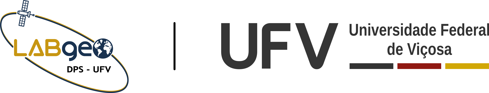
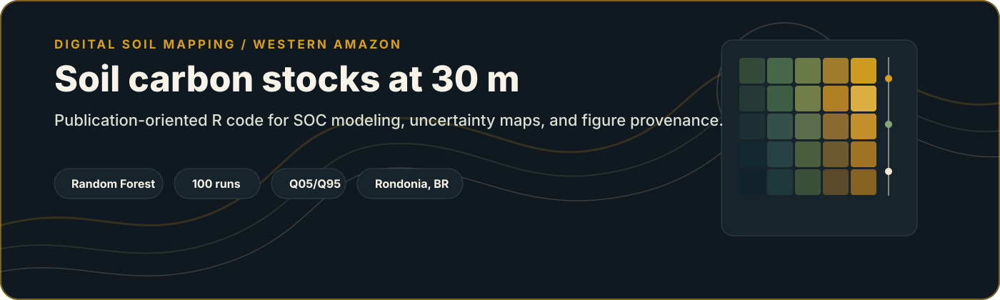
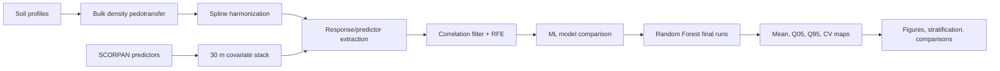

<p align="center">
  
</p>

<p align="center">
  
</p>

<h1 align="center">High-Resolution Mapping of Soil Carbon Stocks<br>in the Western Amazon</h1>

<p align="center">
  <strong>Publication-oriented R scripts, provenance notes, and data links for mapping soil organic carbon stocks in Rondonia, Brazil.</strong>
</p>

<p align="center">
  <a href="https://doi.org/10.1016/j.geodrs.2024.e00773"></a>
  <a href="https://doi.org/10.5281/zenodo.10543942"></a>
  
  
</p>

<p align="center">
  
  
  
  
  
  
</p>

<p align="center">
  <a href="#paper-first">Paper First</a> |
  <a href="#at-a-glance">At A Glance</a> |
  <a href="#workflow">Workflow</a> |
  <a href="#repository-map">Repository Map</a> |
  <a href="#data-products">Data Products</a> |
  <a href="#reproducibility-notes">Reproducibility Notes</a>
</p>

<table align="center">
  <tr>
    <td align="center"><strong>Canonical citation</strong></td>
  </tr>
  <tr>
    <td align="center">
      Moquedace, C. M. et al. (2024). <em>High-resolution mapping of soil carbon stocks in the western Amazon</em>.<br>
      <strong>Geoderma Regional</strong>, 36, e00773. <a href="https://doi.org/10.1016/j.geodrs.2024.e00773">https://doi.org/10.1016/j.geodrs.2024.e00773</a>
    </td>
  </tr>
</table>

## Paper First

This repository supports the scientific article:

> Moquedace, C. M., Baldi, C. G. O., Siqueira, R. G., Cardoso, I. M.,
> de Souza, E. F. M., Fontes, R. L. F., Francelino, M. R., Gomes, L. C.,
> & Fernandes-Filho, E. I. (2024). High-resolution mapping of soil carbon
> stocks in the western Amazon. Geoderma Regional, 36, e00773.
> https://doi.org/10.1016/j.geodrs.2024.e00773

The article is the canonical source for methods, results, and interpretation.
GitHub organizes the code and provenance. Zenodo stores the final map products.
If you came here from the article, start with [docs/reader_guide.md](docs/reader_guide.md).

## At A Glance

<table>
  <tr>
    <td width="25%"><strong>Study area</strong><br>Rondonia, western Amazon, Brazil.</td>
    <td width="25%"><strong>Soil data</strong><br>Almost 3,000 soil profiles from ZEERO/SoilData.</td>
    <td width="25%"><strong>Prediction target</strong><br>SOC stock at standard depth intervals to 1 m.</td>
    <td width="25%"><strong>Output</strong><br>Mean, Q05, Q95, and coefficient-of-variation rasters.</td>
  </tr>
  <tr>
    <td><strong>Resolution</strong><br>30 m environmental covariates.</td>
    <td><strong>Covariates</strong><br>77 SCORPAN predictors harmonized to <code>ESRI:102015</code>.</td>
    <td><strong>Modeling</strong><br>Correlation filtering, RFE, six ML algorithms.</td>
    <td><strong>Final model</strong><br>Random Forest, 100 runs per depth.</td>
  </tr>
</table>

## Workflow


```mermaid
flowchart LR
  A["Soil profiles"] --> B["Bulk density pedotransfer"]
  B --> C["Spline harmonization"]
  D["SCORPAN predictors"] --> E["30 m covariate stack"]
  C --> F["Response/predictor extraction"]
  E --> F
  F --> G["Correlation filter + RFE"]
  G --> H["ML model comparison"]
  H --> I["Random Forest final runs"]
  I --> J["Mean, Q05, Q95, CV maps"]
  J --> K["Figures, stratification, comparisons"]
```

The detailed article-to-script crosswalk is in
[docs/article_traceability.md](docs/article_traceability.md). The workflow
notes are in [docs/workflow.md](docs/workflow.md).

## Repository Map

```text
.
|-- data/                         # Data access notes; large files are not tracked
|-- docs/                         # Workflow, traceability, portability, release notes
|-- img/                          # LabGeo/UFV visual identity
|-- scripts/
|   |-- 01_data_preparation/      # Soil profiles, covariates, raster alignment
|   |-- 02_modeling/              # RFE, model comparison, Random Forest runs
|   |-- 03_prediction/            # Tiled prediction and uncertainty summaries
|   |-- 04_figures_maps/          # Figures, layouts, comparisons
|   `-- 05_legacy_context/        # Legacy scripts retained for method context
|-- CITATION.cff
|-- DESCRIPTION
`-- README.md
```

## Data Products

Final map products are available from Zenodo:

| Resource | Link |
| --- | --- |
| Final maps | https://zenodo.org/records/10543942 |
| DOI | `10.5281/zenodo.10543942` |
| License | Creative Commons Attribution 4.0 International |

Large rasters, shapefiles, model outputs, spreadsheets, and intermediate files
are intentionally excluded from Git. See [data/README.md](data/README.md).

## Reproducibility Notes

The scripts were recovered from publication-era working folders. They preserve
the final article workflow, but are not yet a one-command reproducible
pipeline. Several scripts still contain absolute paths and depend on local
helpers that were not present in the recovered archives.

Relevant notes:

- [docs/reader_guide.md](docs/reader_guide.md)
- [docs/portability_notes.md](docs/portability_notes.md)
- [docs/script_inventory.md](docs/script_inventory.md)
- [docs/github_release_checklist.md](docs/github_release_checklist.md)
- [docs/zenodo_followup_notes.md](docs/zenodo_followup_notes.md)
- [CHANGELOG.md](CHANGELOG.md)

## Citation

If you use this repository, cite the article above and the Zenodo map-products
record. Machine-readable citation metadata is available in [CITATION.cff](CITATION.cff).

## License

The code in this repository is distributed under the MIT License. Final map
products on Zenodo are distributed under Creative Commons Attribution 4.0
International. See [docs/license_notes.md](docs/license_notes.md).

## Contact

For collaboration inquiries:

- cassiomoquedace@gmail.com
- labgeo@ufv.br

The authors are not obligated to provide user support, updates, or bug fixes.
